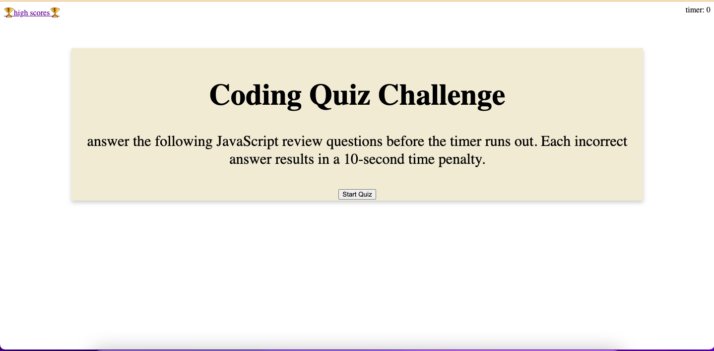
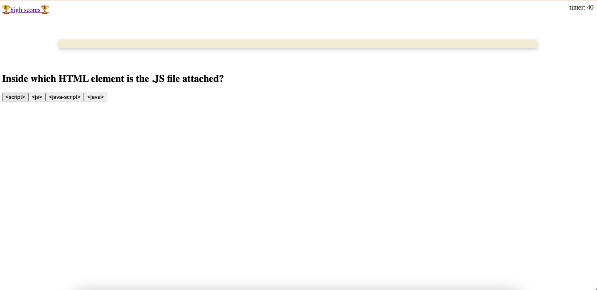

# liz-designs-a-coding-quiz
a game-like web-app to assess learning

##description
This project is a game-like review of javascrip fundamentals.  It includes dynamically created (with JS) buttons to select answer choices and a timer that counts down in second from 60 and deducts 10 points when a wrong answer is chosen.

Through this project, I learned a lot about--and got a bunch of practice with--dynamically creating html elements through javascript.

##usage
This app can be accessed by going to the URL https://lizfischstix.github.io/liz-designs-a-coding-quiz/

##license
MIT license
